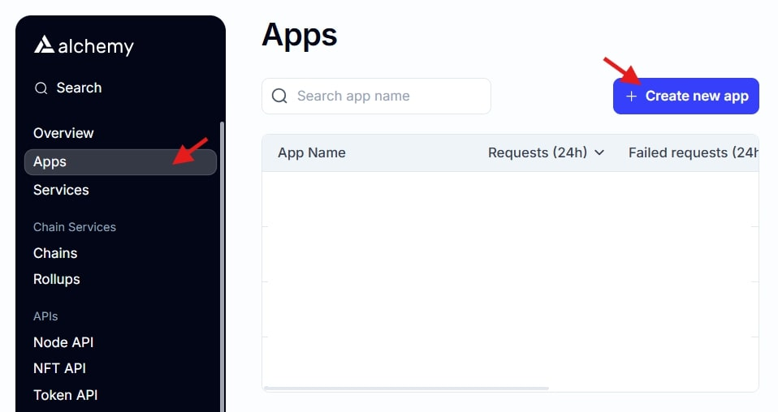
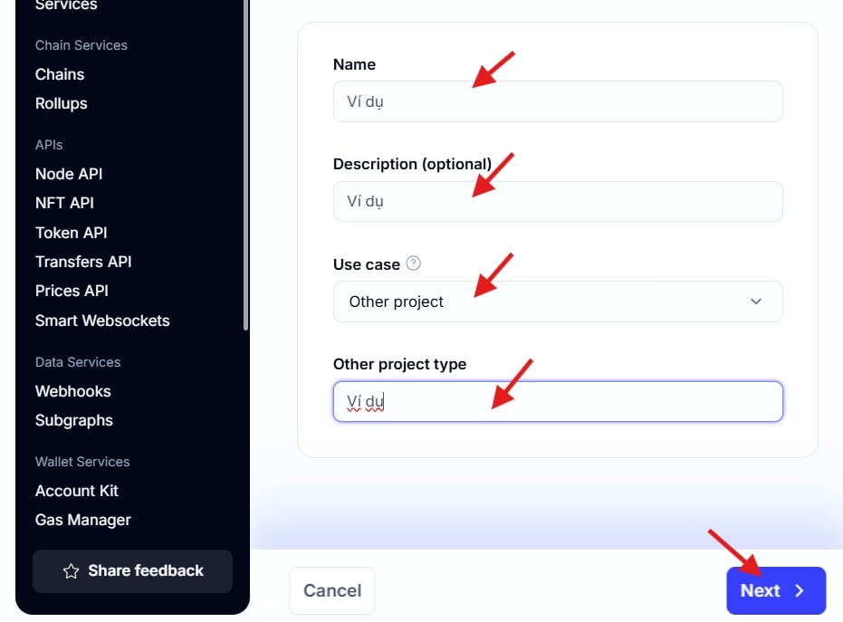
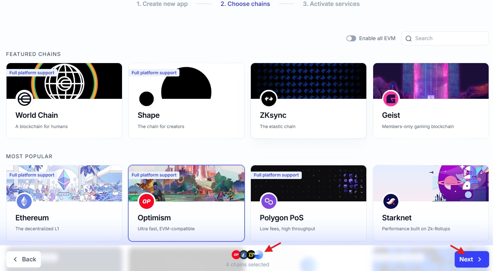
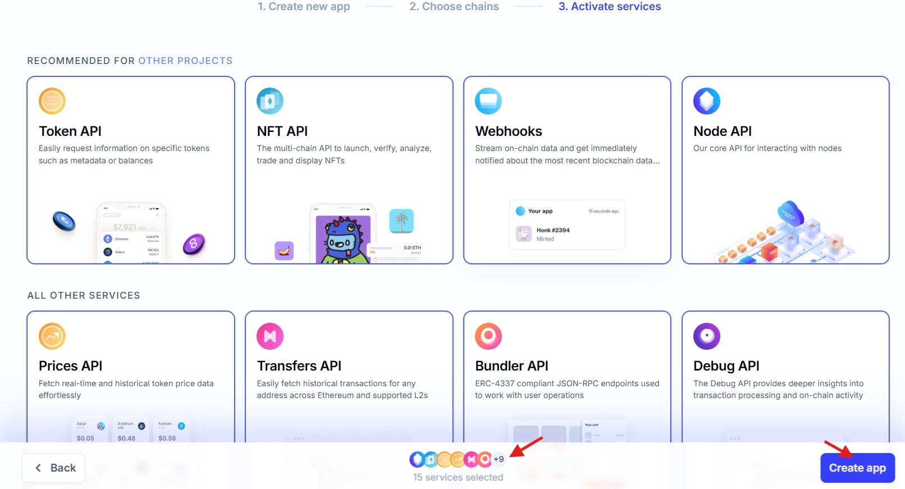
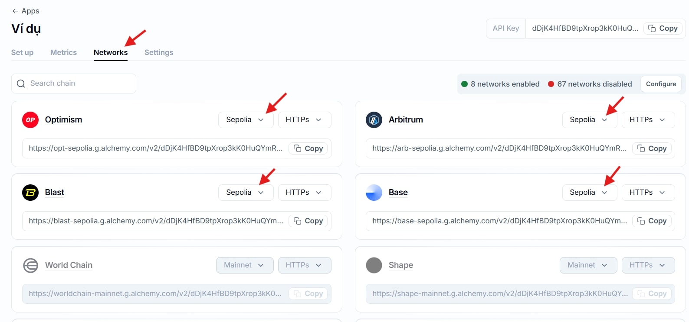

# T3rn Executor
# Hướng dẫn cài đặt T3rn Executor tự động.
``` 
=======================================================
 _____ _  _____   __  __ _   _ ____  ____  _   ___   __ 
|  ___/ \|_   _| |  \/  | | | |  _ \|  _ \| | | \ \ / / 
| |_ / _ \ | |   | |\/| | | | | |_) | |_) | |_| |\ V /  
|  _/ ___ \| |   | |  | | |_| |  _ <|  __/|  _  | | |   
|_|/_/   \_|_|   |_|  |_|\___/|_| \_|_|   |_| |_| |_|   

=======================================================
```
---

Nếu bạn cần hỗ trợ hoặc báo cáo lỗi, hãy liên hệ chúng tôi qua:

- [Telegram](https://t.me/) 
- [Twitter](https://x.com/fat) 
- [Linktr.ee](https://linktr.ee/murphynodeteam)
## Yêu cầu tài nguyên
**Cấu hình:**
<table border="1">
  <tr>
    <th>Tên phần cứng</th>
    <th>Tối thiểu</th>
    <th>Ổn định</th>
  </tr>
  <tr>
    <td>CPU</td>
    <td>Không yêu cầu</td>
    <td>Không yêu cầu</td>
  </tr>
  <tr>
    <td>Ram</td>
    <td>Không yêu cầu</td>
    <td>Không yêu cầu</td>
  </tr>
  <tr>
    <td>GPU</td>
    <td>Không yêu cầu</td>
    <td>Không yêu cầu</td>
  </tr>
  <tr>
    <td>Disk</td>
    <td>Không yêu cầu</td>
    <td>Không yêu cầu</td>
  </tr>
  <tr>
    <td>Bandwidth</td>
    <td>Không yêu cầu</td>
    <td>Không yêu cầu</td>
  </tr>
</table>

**Token:**
<table border="1">
  <tr>
    <th>Mạng</th>
    <th>Số lượng </th>
  </tr>
  <tr>
    <td>arbitrum-sepolia</td>
    <td>>= 2 ETH testnet</td>
  </tr>
    <tr>
    <td>blast-sepolia</td>
    <td>>= 2 ETH testnet</td>
  </tr>
  <tr>
    <td>base-sepolia</td>
    <td>>= 10 ETH testnet</td>
  </tr>
  <tr>
    <td>optimism-sepolia</td>
    <td>>= 10 ETH testnet</td>
  </tr>
  <tr>
    <td>l1rn (<a  href="https://faucet.brn.t3rn.io/" target="_blank"> faucet here</a> )</td>
    <td>> 0.1 BRN</td>
  </tr>
</table>


## 1. Phiên bản
[LINUX - T3rn Executor v0.40.0](https://github.com/fat-murphy/t3rn-executor/archive/refs/tags/v0.40.0.tar.gz)

[LINUX - T3rn Executor v0.33.0](https://github.com/fat-murphy/t3rn-executor/archive/refs/tags/v0.32.0.tar.gz)

[LINUX - T3rn Executor v0.32.0](https://github.com/fat-murphy/t3rn-executor/archive/refs/tags/v0.32.0.tar.gz)

## 2. Đăng ký

**RPC Sepolia: [Alchemy Signup Here](https://dashboard.alchemy.com/usage)**

- Truy cập `Alchemy` -> đăng ký tài khoản.
- Truy cập `Dashbroad` -> `Apps` -> `Create new app`
  


- Điền thông tin app
  


- Chọn mạng (ARB, OP, BASE, BLAST)



- Chọn tất cả các dịch vụ



- Chuyển tab `Networks` -> đổi mạng sang Sepolia cho các mạng vừa chọn



**RPC sẽ tương tự như này:**
  - ARBT: https://arb-sepolia.g.alchemy.com/v2/xxxx
  - BSSP: https://base-sepolia.g.alchemy.com/v2/xxxx
  - OPPS: https://opt-sepolia.g.alchemy.com/v2/xxxx
  - BLSS: https://blast-sepolia.g.alchemy.com/v2/xxxx

## 3. Thiết lập và cài đặt
**Tải file cấu hình và giải nén**
```
# Truy cập quyền root

sudo -i
```
```
# Cập nhật hệ thống và cài đặt curl

apt-get update && apt-get upgrade -y
apt install curl -y
```
```
# Cài đặt node

wget -O v0.40.0.sh https://raw.githubusercontent.com/fat-murphy/t3rn-executor/refs/heads/main/code/v0.40.0.sh && sed -i 's/\r$//' v0.40.0.sh && chmod +x v0.40.0.sh  && ./v0.40.0.sh
```

**Cấu hình node**
  - Chọn tác vụ `1` -> Điền các `RPC`, `Gas` , `PrivateKey` như sau (Gas khuyến nghị >= 100).
 
 
  - Chọn tác vụ `2` -> xem trạng thái node.
  
 
  > Khi thấy logs được sync là bạn đã cài đặt thành công
  > BRN nhận được phụ thuộc vào số lượng bid thành công của bạn (tăng gas sẽ dễ dàng nhận được bid hơn)

## 4. Kiểm tra số lượng BRN
**Truy cập đường link sau, thay thế `address` bằng địa chỉ của bạn:**
https://bridge.t1rn.io/executor/address